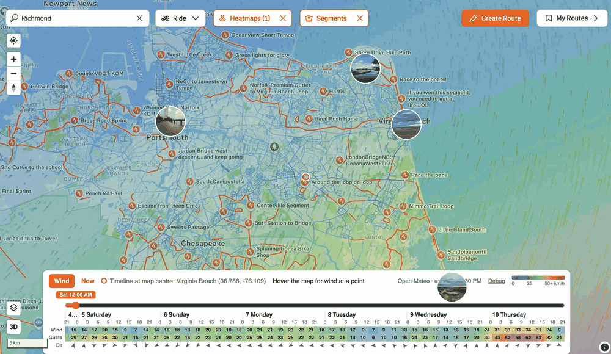

# Strava Wind Overlay

Chrome extension that draws a Windy-style wind layer on Strava maps, with a
forecast timeline so you can plan a ride for a time in the future.



- Animated particles and a speed colour fill on top of the map
- Timeline with day columns and hourly wind, gusts and direction at the map centre
- Forecast up to 6 days ahead, hourly, from [Open-Meteo](https://open-meteo.com)
- Hover the map for wind speed, gusts and direction at any point

## Install from source

```sh
npm install
npm run build
```

Then in Chrome open `chrome://extensions`, enable Developer mode, choose
Load unpacked and select the `dist` folder. Open any page under
`https://www.strava.com/maps/`.

## Develop

```sh
npm run dev     # rebuild on change, then reload the extension in Chrome
npm test
npm run check   # format, lint, type-check
```

## Publish

1. Bump `version` in `package.json` and `public/manifest.json`.
2. Run `npm run package`. It builds and writes `strava-wind-overlay-<version>.zip`.
3. Upload the zip in the Chrome Web Store developer dashboard. The listing needs
   the 128 px icon from `public/icons`, at least one screenshot (1280×800), and
   a link to `PRIVACY.md`. The extension asks for no permissions.

## Debugging

Click Debug in the panel. It copies a report with the map position, fetch
timings, recent events and browser details to the clipboard. Paste it into an
issue. The same events are printed to the DevTools console with the `[swo]`
prefix.

## How it works

Strava renders its map with a WebAssembly engine and exposes no map object.
The extension reads the camera from the URL hash (`#zoom/lat/lng`), projects
with Web Mercator onto a transparent canvas placed over the map, and hides the
layer while the map is being dragged. Wind is fetched as a grid of points
covering the visible area with padding, cached until the view leaves it or the
data is older than three hours. The overlay turns itself off in 3D mode.
